<h1 align="center">🛍️ Gadget Shop</h1>

<p align="center">
  
  
  
  
  
  
  
</p>

A full-stack e-commerce web application built with **Next.js App Router**, **TypeScript**, **SQLite**, **Server Actions**, and **Cloudinary**.

This project was built as a practical full-stack learning project with a focus on real-world e-commerce features such as authentication, product management, shopping cart, checkout, orders, profile management, search, stock validation, and an admin dashboard.

## ✨ Features

### 🛒 Storefront
- Browse products
- Product search
- Product details
- Add products to cart
- Update cart item quantities
- Remove products from cart
- Stock-aware cart validation
- Multiple delivery options
- Automatic subtotal, tax, shipping, and total calculations
- Responsive UI

### 👤 Authentication & Profile
- User registration and login
- Session-based authentication
- Protected profile pages
- Role-based access control
- Profile information page
- Dedicated profile editing flow

### 💳 Checkout & Orders
- Checkout flow
- Server-side stock validation
- Order creation
- Order items stored independently from current product prices
- Delivery status calculation
- User order history
- Admin order management

### 🧑‍💼 Admin Dashboard
- Admin-only routes
- Product management
- Add products
- Edit products
- Product image upload
- User management
- User search
- Order management
- Order search
- Order details
- Recent orders
- Revenue/order information

### 🖼️ Image Management
- Product image upload with Cloudinary
- Image preview before upload
- Existing product images can be displayed while editing
- Cloudinary-hosted image URLs are stored with products

### 🔎 Search & Pagination
- Product search
- Admin user search
- Admin product search
- Admin order search
- Pagination for larger datasets
- URL query parameters for search state

## 🧰 Tech Stack

| Technology | Purpose |
| --- | --- |
| **Next.js** | Full-stack React framework and App Router |
| **React** | UI components and client-side interactions |
| **TypeScript** | Static typing |
| **SQLite** | Relational database |
| **better-sqlite3** | SQLite access from Node.js |
| **Server Actions** | Server-side form mutations |
| **Cloudinary** | Product image storage and delivery |
| **Day.js** | Date calculations and order delivery status |
| **CSS Modules** | Component/page-scoped styling |

## 🏗️ Architecture

The project uses the **Next.js App Router** and separates storefront, authentication, profile, and admin routes using route groups and nested layouts.

A simplified structure:

```text
online-shop-app/
├── action/
│   └── logoutAction.ts
│
├── app/
│   ├── (auth)/
│   ├── (marketing)/
│   ├── (profile)/
│   ├── admin/
│   ├── globals.css
│   └── layout.tsx
│
├── components/
│   ├── admin/
│   ├── auth/
│   ├── marketing/
│   └── profile/
│
├── lib/
│   ├── auth.ts
│   ├── shopdb.ts
│   ├── redirectByRole.ts
│   └── cloudinary.ts
│
├── screenshots/
│   ├── home.png
│   ├── product.png
│   ├── cart.png
│   ├── email-sent.png
│   ├── login.png
│   ├── signup.png
│   ├── orders.png
│   ├── profile.png
│   ├── admin-dashboard.png
│   ├── admin-add-product.png
│   ├── admin-products.png
│   ├── admin-users.png
│   └── admin-orders.png
│
├── public/
│   ├── icons/
│   ├── logos/
│   └── images/
│
├── scripts/
│   ├── migrate.ts
│   ├── delete.ts
│   └── admin.ts
│
├── envConfig.ts
├── eslint.config.mjs
├── next.config.ts
├── package.json
├── package-lock.json
├── README.md
└── tsconfig.json
```

## 🗄️ Database

The application uses SQLite with a relational schema centered around users, products, carts, and orders.

Main tables:

```text
users
  │
  ├── carts
  │     └── cart_items ─── products
  │
  └── orders
        └── order_items ─── products
```

### Main tables

- `users` — registered users and their roles
- `session` — authentication sessions
- `products` — product information, prices, stock, categories, descriptions, and image URLs
- `carts` — user shopping carts
- `cart_items` — products and quantities inside carts
- `orders` — completed customer orders
- `order_items` — historical product/price/quantity information for each order

Prices are stored as **integer cents** instead of floating-point currency values. For example:

```text
$19.99 → 1999 cents
```

This avoids common floating-point precision problems when performing monetary calculations.

Order items also preserve their own `price_cents`, so historical orders are not affected when a product's current price changes.

## 🔐 Authentication & Authorization

The application uses server-side session handling and protects routes based on the authenticated user.

There are two important concepts:

### Authentication

Determines **who the user is**.

For example:

```text
Login
  ↓
Create session
  ↓
Store session identifier in cookie
  ↓
Read current user on protected requests
```

### Authorization

Determines **what the user is allowed to do**.

For example:

```text
User
 ├── Store
 ├── Cart
 ├── Checkout
 └── Profile

Admin
 ├── Store
 ├── Cart
 ├── Checkout
 ├── Profile
 └── Admin Dashboard
```

Admin routes and mutations verify the current user's role on the server.

## ⚡ Server Components & Client Components

The application takes advantage of the App Router's Server/Client Component model.

Server Components are used for operations such as:

- Reading database data
- Loading the current user
- Rendering product/order data
- Performing server-side redirects
- Protecting server-rendered routes

Client Components are used when browser-side interactivity is required, such as:

- `useState`
- `useEffect`
- `useActionState`
- `useRef`
- Toast notifications
- Interactive forms
- Client-side navigation

This keeps database access and sensitive server logic on the server while limiting client-side JavaScript to interactive parts of the UI.

## 🔄 Server Actions

Forms that modify application data use Server Actions where appropriate.

Examples include:

- Adding a product
- Editing a product
- Updating cart quantity
- Removing cart items
- Creating an order
- Updating user information

A typical mutation follows this flow:

```text
Client form
    ↓
Server Action
    ↓
Authentication / authorization
    ↓
Validate input
    ↓
Database mutation
    ↓
Revalidate affected route
    ↓
Updated UI
```

## 📦 Stock Validation

Stock is validated on the server instead of relying only on the UI.

For example, when updating a cart quantity:

```text
Requested quantity
        ↓
Find current product stock
        ↓
Is product available?
        ↓
Is stock >= requested quantity?
      ↙       ↘
    No         Yes
    ↓           ↓
 Return error   Update cart
```

This prevents users from bypassing client-side restrictions and requesting quantities that are not available.

## 🖼️ Cloudinary

Product images are uploaded to Cloudinary instead of being stored directly inside the application repository.

The general flow is:

```text
Product form
    ↓
File selected
    ↓
Optional client-side preview
    ↓
Server Action
    ↓
Cloudinary upload
    ↓
secure image URL
    ↓
Save URL in products table
```

Cloudinary's Node.js SDK supports server-side uploads and streaming uploads, making it suitable for handling uploaded product media.

## 🔄 Cache Revalidation

After mutations, affected pages are revalidated so the UI can reflect the latest database state.

For example:

```ts
revalidatePath('/cart');
```

This is useful after operations such as:

- Updating cart quantities
- Adding/editing products
- Creating orders
- Updating profile information

## 🔎 URL-Based Search

Search state is represented with query parameters where appropriate.

For example:

```text
/admin/users?search=alex
/admin/orders?search=102
/search?q=iphone
```

This makes search state:

- Shareable
- Bookmarkable
- Compatible with browser navigation
- Easier to combine with filters and pagination

## 📱 Responsive Design

The UI is designed for both desktop and mobile screens using responsive CSS and CSS Modules.

The project uses:

- CSS Grid
- Flexbox
- Media queries
- Responsive typography
- Responsive forms
- Mobile-friendly admin controls

## 🚀 Getting Started

### 1. Clone the repository

```bash
git clone <your-repository-url>
cd online-shop-app-nextjs
```

### 2. Install dependencies

```bash
npm install
```

### 3. Configure environment variables

Create a `.env.local` file and add the environment variables required by your local setup.

Example:

```env
# Database
# Add the variables required by your database setup if applicable.

# Cloudinary
CLOUDINARY_CLOUD_NAME=your_cloud_name
CLOUDINARY_API_KEY=your_api_key
CLOUDINARY_API_SECRET=your_api_secret
```

> Never commit `.env.local`, API keys, API secrets, or other credentials to Git.

### 4. Initialize the database

Make sure the SQLite database/schema used by the project is initialized before starting the application.

### 5. Start the development server

```bash
npm run dev
```

Open:

```text
http://localhost:3000
```

## 🏭 Production Build

Create a production build:

```bash
npm run build
```

Then start the production server:

```bash
npm start
```

Before deploying, make sure:

- Production environment variables are configured
- The database is available to the deployed application
- Cloudinary credentials are configured
- Uploaded images are stored externally rather than relying on the local filesystem
- The deployment platform supports the application's server-side database/runtime requirements

## 🧪 Validation & Error Handling

The application validates important data on the server, including:

- Product IDs
- Quantities
- Stock values
- Product prices
- Required form fields
- User authentication
- User authorization
- Product existence
- Cart ownership
- Order ownership

Errors are returned to the UI where appropriate and displayed using toast notifications or inline messages.

## 🎯 What I Practiced

This project was built to practice and understand:

- Next.js App Router
- Nested layouts
- Route groups
- Dynamic routes
- Server Components
- Client Components
- Server Actions
- `useActionState`
- Form handling with `FormData`
- Authentication and sessions
- Role-based authorization
- SQLite
- SQL joins and aggregation
- Database transactions
- Foreign keys
- Shopping cart architecture
- Checkout logic
- Order and order-item modeling
- Stock validation
- Search and pagination
- URL query parameters
- Cache revalidation
- Cloudinary uploads
- Responsive UI
- Component organization
- CSS Modules
- TypeScript

## 📸 Screenshots

### Home Page
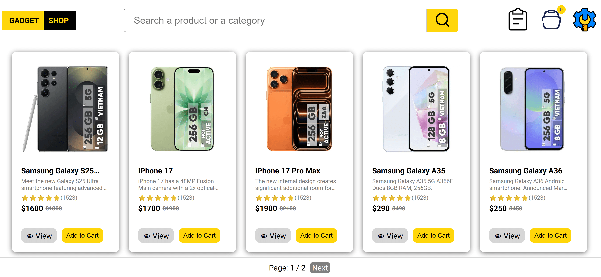

### Cart
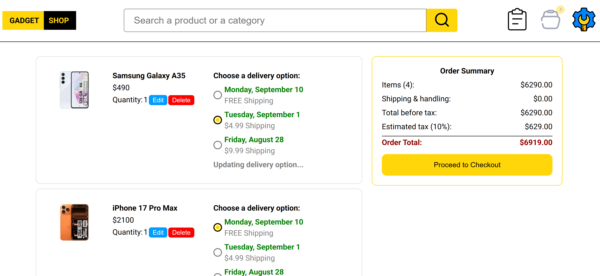

### Orders Page
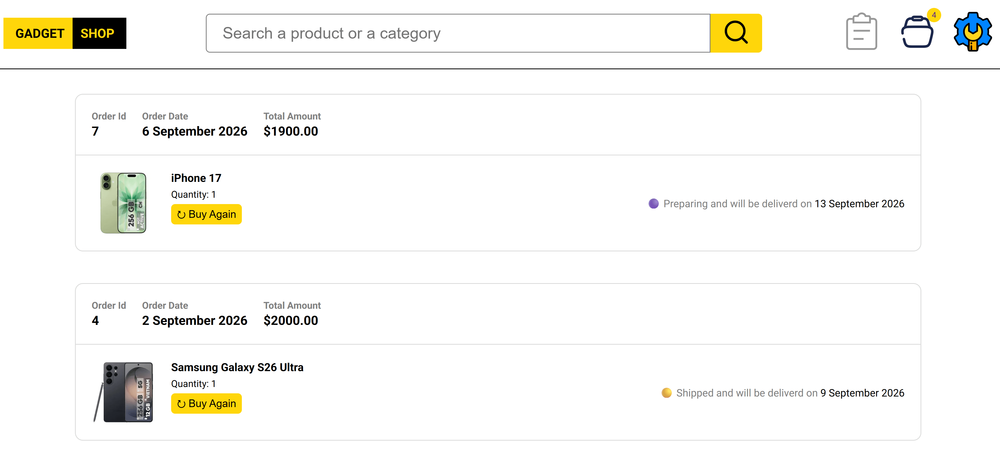

### Login Page
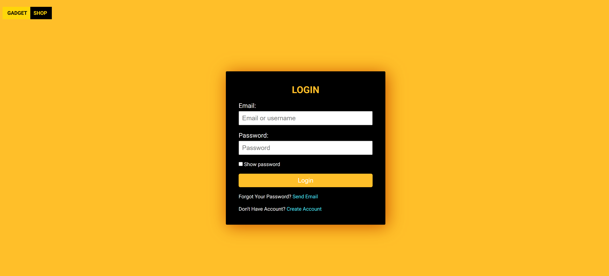

### Signup Page
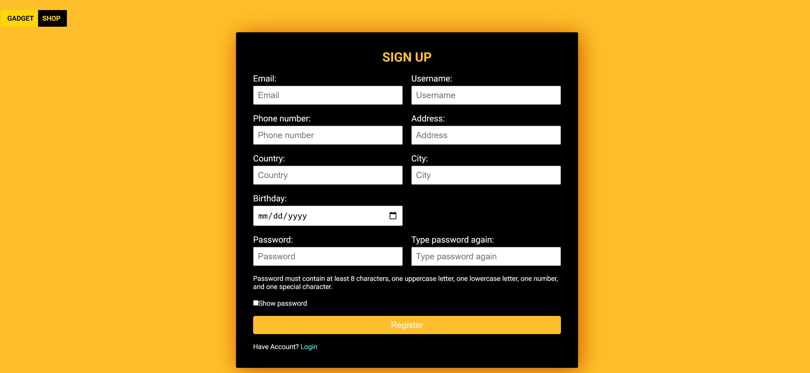

### Email Sent Page
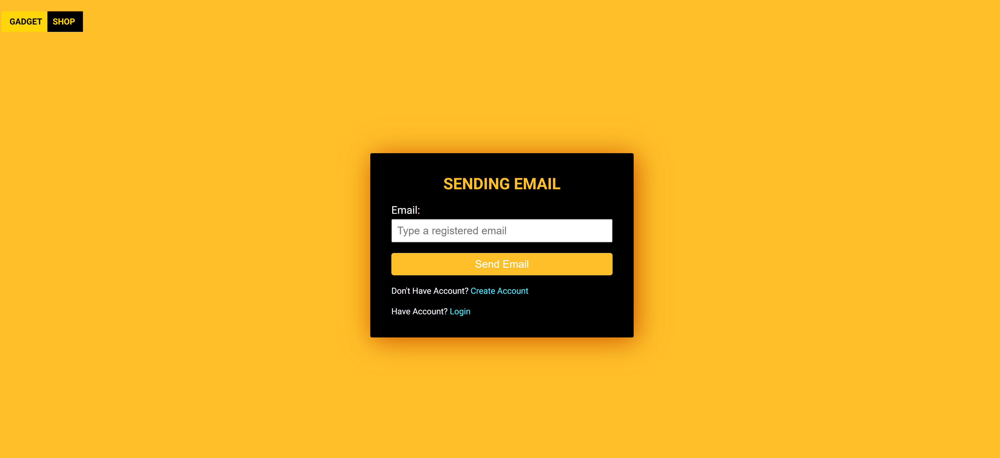

### Admin Dashboard
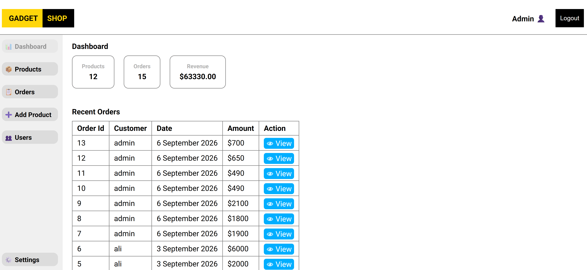

### Admin Products
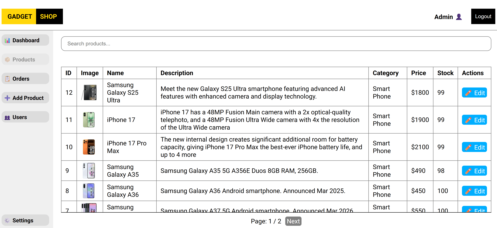

### Admin Orders
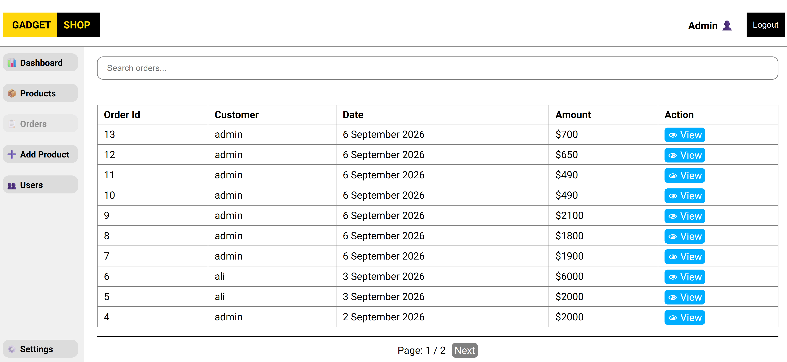

### Admin Add Product
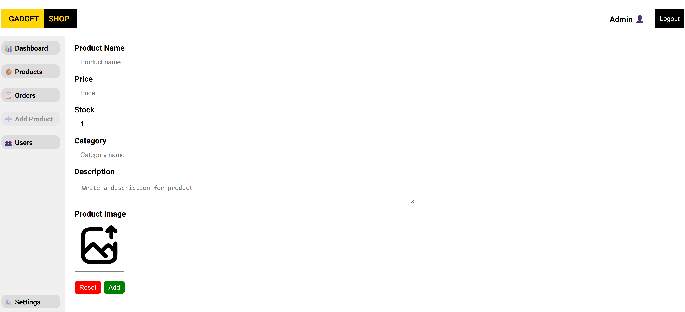

### Admin Users
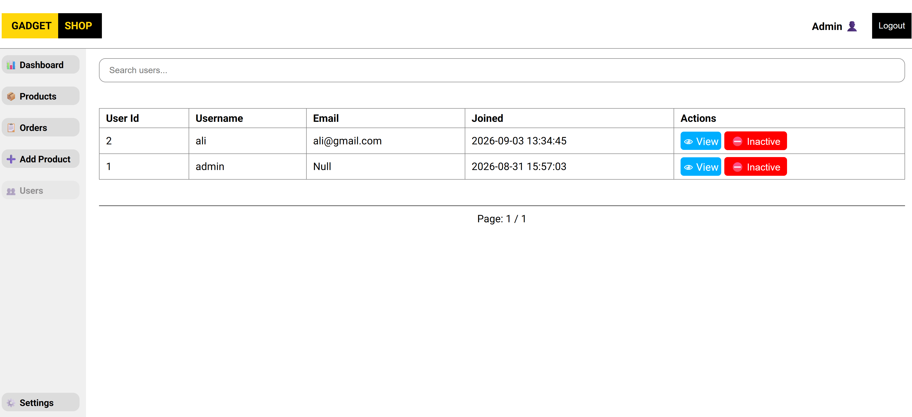

## 📚 Resources

- [Next.js Documentation](https://nextjs.org/docs)
- [Next.js App Router Documentation](https://nextjs.org/docs/app)
- [React Documentation](https://react.dev/)
- [TypeScript Documentation](https://www.typescriptlang.org/docs/)
- [SQLite Documentation](https://sqlite.org/docs.html)
- [better-sqlite3](https://www.npmjs.com/package/better-sqlite3)
- [Cloudinary Documentation](https://cloudinary.com/documentation)
- [Day.js Documentation](https://day.js.org/docs/en/installation/installation)

## ⚠️ Production Notes

This project is primarily a learning/portfolio application. Before using a similar architecture for a high-traffic production store, additional concerns should be evaluated, including:

- Database hosting and scalability
- Connection management
- Transaction isolation and concurrent checkout behavior
- Payment provider integration
- Rate limiting
- CSRF/XSS/security hardening
- Input validation and sanitization
- Image upload restrictions
- Observability and logging
- Backups and disaster recovery
- Email/order notifications
- Automated tests
- Deployment-specific filesystem/database constraints

For a larger production workload, a hosted relational database such as PostgreSQL may be more appropriate than a local SQLite database.

## 📄 License

This project is licensed under the **MIT License**.

See the `LICENSE` file for more information.

---

## 👨‍💻 Author

**Mahdi Gorbany**

- GitHub: [@mahdi911110](https://github.com/mahdi911110)

---

## 🙌 Acknowledgements

- Icons from [SVG Repo](https://www.svgrepo.com/).
- Built with ❤️ using **React** and **NEXTJS**.